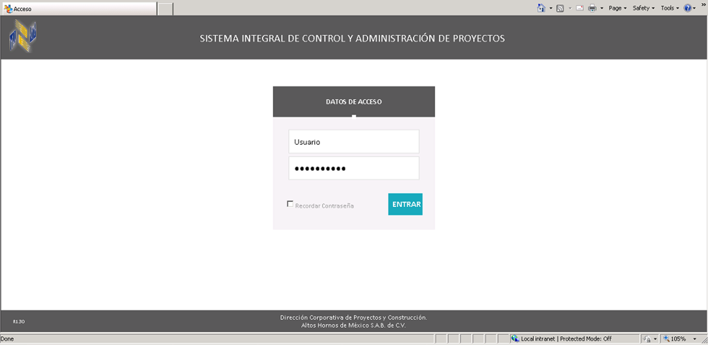
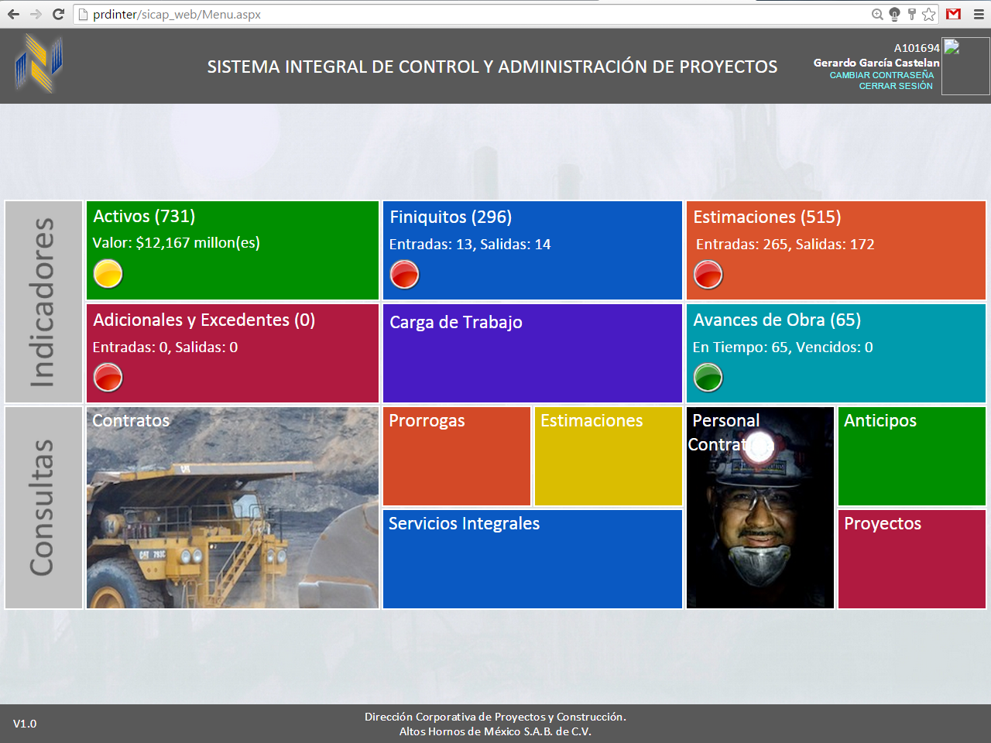

# 🌐 SICAP Web

## 🧭 Overview
**SICAP Web** is a browser-based enterprise platform designed for Directors and Managers to monitor project KPIs, estimations, and contract performance at a high level. It extends the functionality of the core **[SICAP](https://github.com/HermiloOrtega/SICAP)** by offering a real-time, responsive, and mobile-accessible alternative—particularly for users on Mac or remote environments.

The platform is hosted on internal servers and built using **ASP.NET**, **C#**, **JavaScript**, and **SQL Server**. It provides visual breakdowns, monthly performance charts, and dynamic tables for KPI-driven decision-making.

### Login screen

### Home page

### Active contracts

### Active contracts details

## 💡 Idea & Concept
Designed to overcome limitations of the **[SICAP](https://github.com/HermiloOrtega/SICAP)** platform dependency (Windows-only)
SICAP Web empowers executives with:
- Visual indicators and summaries of projects by status (active, delayed, overdue)
- Drill-down capabilities into departments, project types, and engineer-specific performance
- Full access from Mac devices and remote networks

## ✨ Features & Functionality
- 📊 Bar graphs summarizing project performance month-over-month
- 🟢🟡🔴 Traffic light indicators per KPI
- 🔍 Filters by direction, subdirection, department, and individual engineer
- 🧾 Detail views with contract info, % progress, delays, and financials
- 📤 Export to Excel functionality
- 🧭 Navigation per month, year, and KPI category
- 🔐 Role-based access with environment selector (DEV/QAS/PRD)

## ⚙️ Tech Stack
- **Frontend:** HTML, CSS, JavaScript
- **Backend:** ASP.NET WebForms, Visual Basic
- **Database:** SQL Server (shared with **[SICAP](https://github.com/HermiloOrtega/SICAP)** and **[SICAP Indicators](https://github.com/HermiloOrtega/SICAP-Indicators)**)
- **Reporting:** Embedded charts and data tables
- **IDE:** Visual Studio

## 🏗 Architecture & Design
- ASP.NET WebForms application hosted on company intranet
- Shared database layer with **[SICAP](https://github.com/HermiloOrtega/SICAP)** for unified KPI logic
- Modular design using master pages and web user controls
- Performance-focused with pre-aggregated monthly data
- Optimized for Mac and desktop browsers

## 🚀 Installation & Setup
- **Deployment:** Internal IIS Web Server
- **Access:** Secure login via intranet browser
- **Environments:** DEV / QAS / PRD (switchable)
- **Permissions:** Managed through Active Directory-like system

> **Note:** The platform requires **[SICAP](https://github.com/HermiloOrtega/SICAP)** Updater for backend sync.

## 🧑‍💻 Usage
1. Login with role-based credentials
2. Select environment: DEV, QAS, or PRD
3. Navigate to KPI dashboards and click on traffic lights to drill into data
4. View trends, compare actual vs goal, and export if needed

## 🔍 My Role & Contributions
- 💼 Full-stack developer of SICAP Web
- 🧱 Designed backend and UI with real-time filters and charts
- 📈 Connected **[SICAP](https://github.com/HermiloOrtega/SICAP)** Updater output for fresh data feeds
- 🤝 Coordinated QA and user testing with directors

## 🧗 Challenges & Learnings
- Translating dense WinForms functionality into web workflows
- Ensuring fast, responsive filtering with heavy KPI data
- Creating a secure, role-specific experience compatible with Macs
- Embedding legacy data from SAP into modern dashboards

## 📈 Future Enhancements
- Replace legacy chart components with modern JS libraries
- Add authentication via Microsoft Entra ID / Azure SSO
- Build a mobile-first version or native app

## 🪪 License
⚠️ **Internal Use Only**  
Originally under MIT; changed to **CC BY-NC-ND 4.0** as of April 22, 2025.

## 🔗 Related Projects
- **[SICAP Indicators](https://github.com/HermiloOrtega/SICAP-Indicators)**
- **[SICAP](https://github.com/HermiloOrtega/SICAP)**
- **[SICAP Updater](https://github.com/HermiloOrtega/SICAP-Web-Updates)**
- **[SICAP Foliador](https://github.com/HermiloOrtega/SICAP-Folio-Manager)**